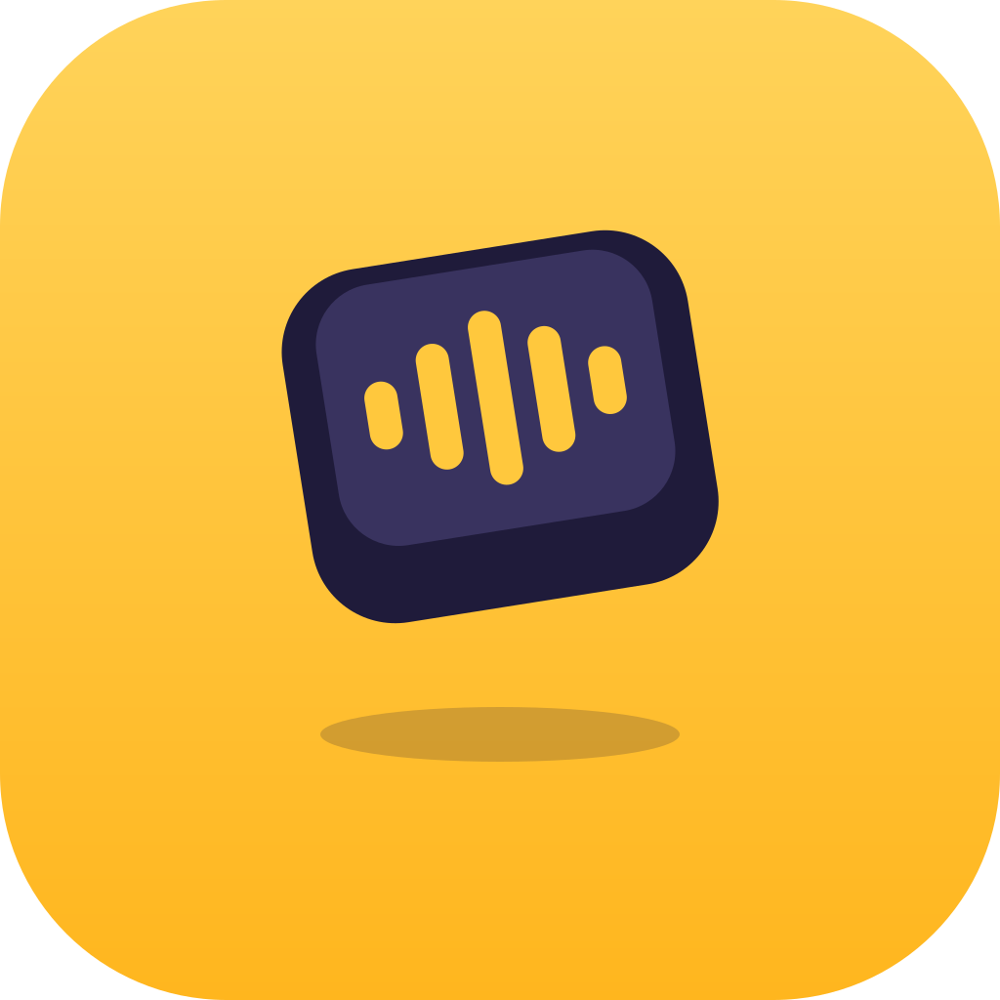
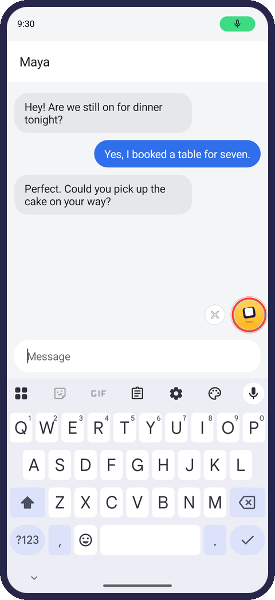
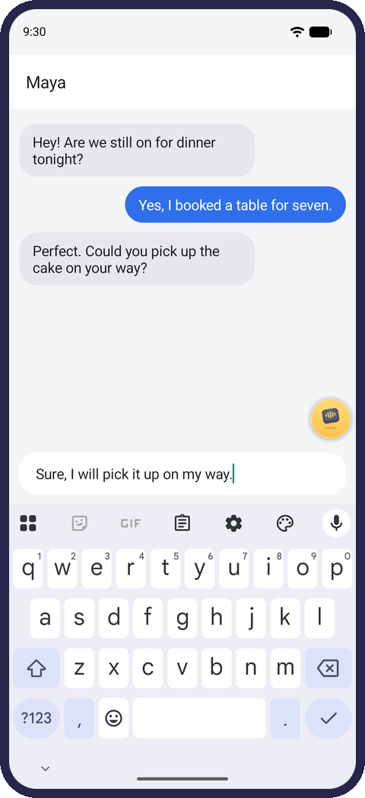
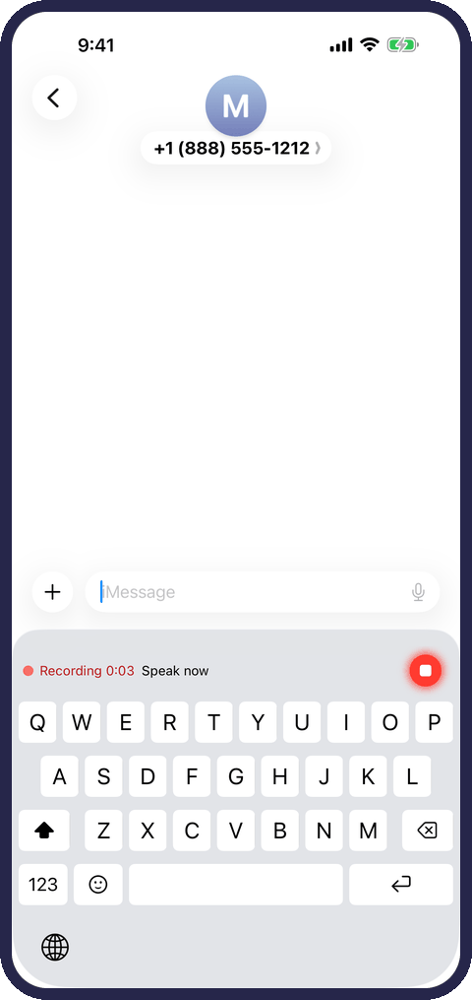
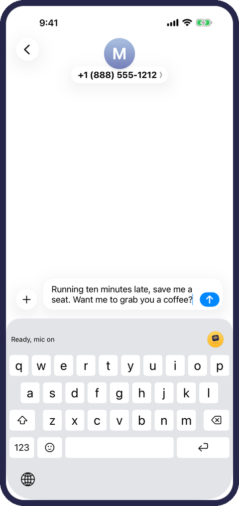
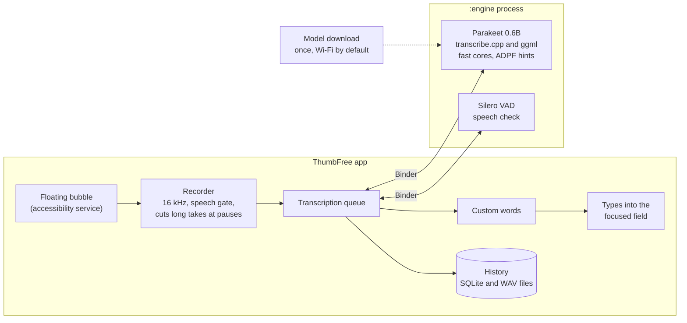

<p align="center">
  
</p>

<h1 align="center">ThumbFree</h1>

<h3 align="center">Talk. It types.</h3>

<p align="center">
  Free, open-source voice typing for Android and iPhone. It works offline, and your voice never leaves your phone.
</p>

<p align="center">
  <a href="https://kabrapratik28.github.io/ThumbFree/beta/"></a>
</p>

<p align="center">
  For Android 13 or newer.<br>
  iPhone: coming soon to the App Store.
</p>

<p align="center">
  
  
  
  
</p>

<p align="center">
  <b>Android:</b> tap the yellow bubble and talk.<br>
  <b>iPhone:</b> tap the mic on the ThumbFree keyboard.<br>
  Tap again, and your words appear at the cursor.
</p>

<p align="center">
  <b>Like ThumbFree? Please give it a ☆ Star</b> at the top of this page. It helps other people find it.
</p>

<p align="center">
  <a href="https://www.buymeacoffee.com/kabrapratik28"></a>
</p>

## Why ThumbFree

- **Works where you type.** Messages, email, notes, search boxes: your words go where your cursor is.
- **Private.** Speech is turned into text on your phone. Your audio and your words never leave it. No account, no analytics, no ads.
- **Works offline.** The internet is used only to download speech models. Once your model is on the phone, ThumbFree works in airplane mode.
- **Fast, even for long notes.** On a Pixel 10 the text appears 0.7 to 0.9 seconds after you stop talking, whether you spoke for 4 seconds or 30. On an iPhone 16 it is ready about 0.12 seconds after you tap stop at the end of a sentence ([how it was measured](#speed-and-accuracy)).
- **Accurate.** Both apps run NVIDIA's Parakeet speech models. On Android the English model gets 3.5% of words wrong on our public test clips.
- **25 languages.** English by default. The Multilingual model understands 25 European languages.
- **Spells your words your way.** Add names, brands and jargon to the Dictionary ("chat gpt" becomes ChatGPT). History keeps every take on your phone to search, copy or transcribe again, for as long as you choose.

## Get ThumbFree

- **Android 13 or newer:** ThumbFree is in a closed test on Google Play. [Join the test](https://kabrapratik28.github.io/ThumbFree/beta/): 2 steps, about 2 minutes.
- **iPhone with iOS 26 or newer:** coming soon to the App Store.
- Setup downloads a speech model once, over Wi-Fi unless you allow mobile data. The English model is about 731 MB on Android and about 465 MB on iPhone.
- The [website](https://kabrapratik28.github.io/ThumbFree/) shows how to use it and answers common questions. Or build it yourself: [Android](#build-the-android-app), [iPhone](#build-the-iphone-app).

## Privacy

- No accounts, no analytics, no ads.
- Audio and text stay on the phone. History is stored only on the phone and follows your retention setting.
- The only network use is downloading speech models from pinned Hugging Face revisions, checked with SHA-256 before use.
- On Android, the accessibility service only shows the bubble and types your words. It reads only the field you're typing in, and never types into password fields.
- On iPhone, Full Access lets the keyboard work with the ThumbFree app on your phone. The keyboard never goes online.

The privacy policies: [Android](https://kabrapratik28.github.io/ThumbFree/android-privacy.html) and [iPhone](https://kabrapratik28.github.io/ThumbFree/privacy.html).

## Support ThumbFree

ThumbFree is free and has no ads. If it saves you time, you can help pay for its development: [buy me a coffee](https://www.buymeacoffee.com/kabrapratik28) or [sponsor it on GitHub](https://github.com/sponsors/kabrapratik28). You can also help by [reporting a bug](https://github.com/kabrapratik28/ThumbFree/issues) or telling a friend.

## For developers

ThumbFree is two apps in one repository. They share the product rules, the brand and the docs; each has its own code and its own engine.

| | Android | iPhone |
|---|---|---|
| Folder | [`android/`](android/) | [`ios/`](ios/) |
| How it types into other apps | A floating bubble, run by an accessibility service | The ThumbFree keyboard |
| Speech engine | Parakeet on transcribe.cpp and ggml, in a separate process | Parakeet on Core ML, with its own runner |
| English model | Parakeet Unified EN 0.6B, 8-bit | Parakeet TDT 0.6B v2 |
| 25 European languages | Parakeet TDT 0.6B v3, 8-bit | Parakeet TDT 0.6B v3 |
| Written in | Kotlin, Jetpack Compose and C++ | Swift, SwiftUI and UIKit |

## Android app

### How it works



1. **Bubble.** An Android accessibility service shows the bubble when an editable field has focus and hides it otherwise. It reads only the focused field, to place text and spacing correctly. The bubble stays wherever you drop it, and you choose its size and transparency.
2. **Recorder.** Audio is captured at 16 kHz in 20 ms blocks. A speech gate and the Silero voice detector keep silence and noise from ever typing text. Long takes are cut at natural pauses and transcribed while you are still talking, which is why stop-to-text stays short at any length.
3. **Engine.** Transcription runs in a separate `:engine` process through [transcribe.cpp](https://github.com/handy-computer/transcribe.cpp) and ggml. Our own patches (`third_party/patches/`) add the audio front end, 8-bit weights and fast CPU kernels. They also keep a long-lived thread pool pinned to the fast cores. The recommended model is NVIDIA Parakeet Unified EN 0.6B (8-bit), the most accurate for English. Parakeet TDT 0.6B v3 (8-bit), a choice in Settings, speaks 25 European languages and hears which one you use.
4. **Text.** Custom words from the Dictionary fix spellings, then the text is typed into the field. Every take is saved to History until your retention setting removes it.

### Speed and accuracy

| Audio length | Stop tap to text |
|---|---|
| 3.7 s | 0.69 s |
| 7.5 s | 0.77 s |
| 11.0 s | 0.88 s |
| 15.1 s | 0.76 s |
| 18.3 s | 0.88 s |
| 29.4 s | 0.90 s |

Time from the stop tap to the text appearing, Pixel 10 in airplane mode, medians of 3 runs. The English model's word error rate is 3.47% on the 11 public clips in [`testdata/public-bench/`](testdata/public-bench/). Full results and the method are in [docs/benchmarks/2026-09-26-speed.md](docs/benchmarks/2026-09-26-speed.md).

### Build the Android app

Requirements: Android Studio with its bundled JDK 21, Android SDK 37, NDK 30.0.16248370 and CMake 4.1.2.

```sh
git clone --recursive https://github.com/kabrapratik28/ThumbFree.git
cd ThumbFree/android
./gradlew :app:assembleDebug
adb install -r app/build/outputs/apk/debug/app-debug.apk
```

Host tests, in `android/`: `./gradlew :app:testDebugUnitTest`. Device tests and the rest of the workflow are in [CONTRIBUTING.md](CONTRIBUTING.md) and [android/AGENTS.md](android/AGENTS.md).

<details>
<summary>What the first launch does</summary>

On first launch the welcome screens say what the app does and ask for your language. Its tap starts the speech model download (about 731 MB, over Wi-Fi), and the first step waits there while the model downloads, is checked and loads. Then you try the bubble once inside the app; the microphone is asked for at your first tap. Next comes the accessibility service, with one picture of Android's Settings that shows what to turn on. Once the service is on, the app comes back by itself and says you're all set, or what is still missing. For development, `android/tools/push-test-model.sh <serial>` copies a model from your computer instead.

</details>

### Experimental: live preview

The app can show your words next to the bubble while you speak. The feature is built and tested but hidden and off: it types the same text, but costs about 3 times the energy while you dictate. The measurements are in [docs/benchmarks/2026-09-26-speed.md](docs/benchmarks/2026-09-26-speed.md#live-preview).

## iPhone app

### How it works

- **How it types into other apps.** iOS lets no app draw over other apps or type into them, so on iPhone ThumbFree is a keyboard. Switch to the ThumbFree keyboard with the globe key, tap its mic, speak, and tap again: your words appear at the cursor.
- **Why the app records.** iOS gives a keyboard no microphone and too little memory for a speech model. So the keyboard asks the ThumbFree app to record. The two share files through an App Group, which is why the keyboard asks for Full Access. The first tap of a session opens the app to turn the mic on; you swipe back to your app, and later taps start at once. The keyboard types each take once, only into the field it belongs to.
- **Speech to text.** The app runs NVIDIA Parakeet TDT 0.6B v2 (English) or v3 (25 European languages) on Core ML with its own runner, the Encoder on the Neural Engine. On an iPhone 16 the text is ready about 0.12 seconds after you tap stop at the end of a sentence ([benchmark](ios/docs/benchmarks/2026-09-27-iphone16-device.md)).
- **A full keyboard too:** letters in Apple's layout, emoji, suggestions and autocorrect.

### Build the iPhone app

You need a Mac with Apple silicon and macOS 26 or newer, Xcode 27 with the iOS 26.5 Simulator runtime, and [XcodeGen](https://github.com/yonaskolb/XcodeGen):

```sh
brew install xcodegen
git clone https://github.com/kabrapratik28/ThumbFree.git
cd ThumbFree/ios
xcodegen generate          # writes ThumbFree.xcodeproj from project.yml; git ignores it
open ThumbFree.xcodeproj   # run the ThumbFree scheme on an iPhone Simulator
```

Simulator builds need no Apple team. [ios/README.md](ios/README.md) has the features, how the app works and its speed; the tests are in [CONTRIBUTING.md](CONTRIBUTING.md) and [ios/AGENTS.md](ios/AGENTS.md).

## Project layout

| Path | What is there |
|---|---|
| `android/` | The Android app: its Gradle project, the app code (one package per area), the JNI bridge and its tools |
| `ios/` | The iOS app: the app, the keyboard, the widget, `ThumbFreeKit` (text rules and the Core ML engine), tests and tools |
| `third_party/transcribe.cpp`, `third_party/patches/` | The Android app's speech engine (a git submodule) and our patch series for it |
| `testdata/public-bench/` | Public test clips with their reference texts |
| `docs/` | Benchmarks, decisions, the brand kit and the privacy policy |
| `tools/` | Checks for the whole repository, and a Mac check of the engine patches |
| `AGENTS.md` | Instructions for contributors and AI agents, with one per folder that has its own rules |

## Contributing

Contributions are welcome. Start with [CONTRIBUTING.md](CONTRIBUTING.md) for setup, tests and the pull request checklist; [AGENTS.md](AGENTS.md) has the full rules, for people and AI agents alike. In short: every change comes with tests, nothing leaves the phone, and no private recordings go in the repository.

## License

ThumbFree is licensed under the [Apache License 2.0](LICENSE). See [NOTICE](NOTICE). ThumbFree builds on open-source engines, NVIDIA's Parakeet models and public data, which keep their own licenses: [THIRD_PARTY_NOTICES.md](THIRD_PARTY_NOTICES.md) credits each one, with the model sources, the test audio and the dependencies.
