<p align="center">
  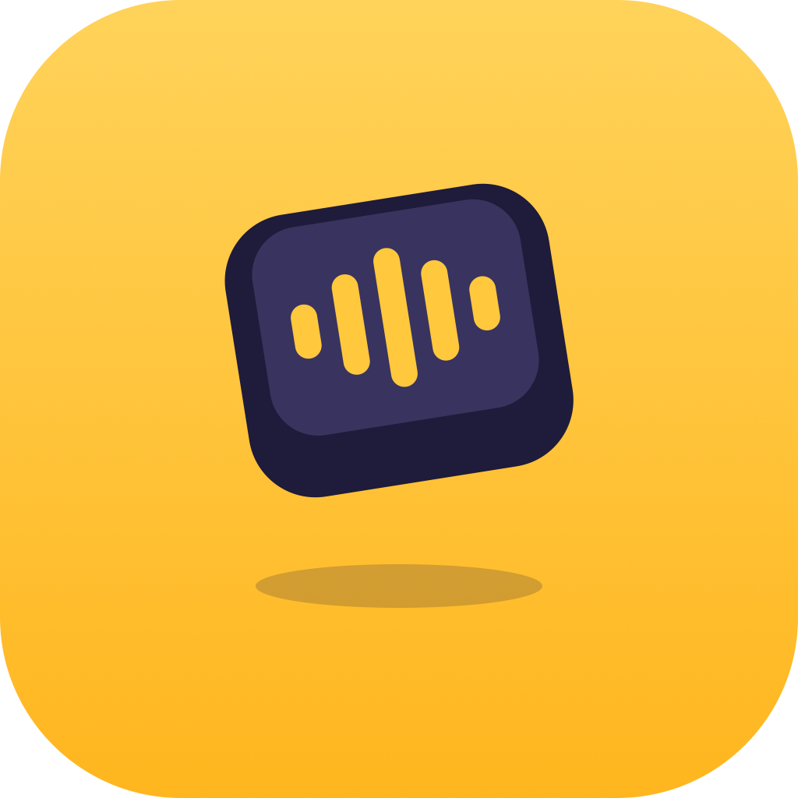
</p>

<h1 align="center">ThumbFree</h1>

<p align="center"><b>Talk instead of typing, in any app. Offline, private and fast.</b></p>

<p align="center">For Android 13 and newer, and for iPhone with iOS 26 and newer. Free and open source.</p>

<p align="center"><b>Android</b></p>
<p align="center">
  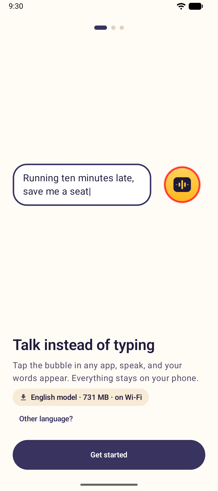
  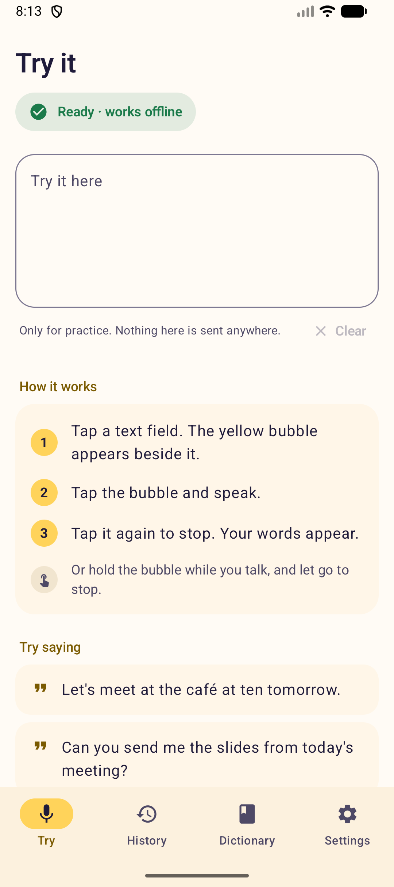
  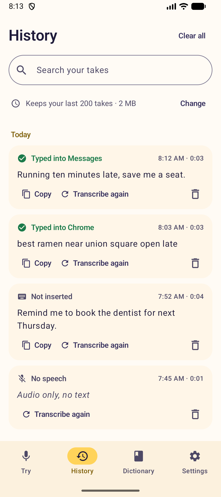
  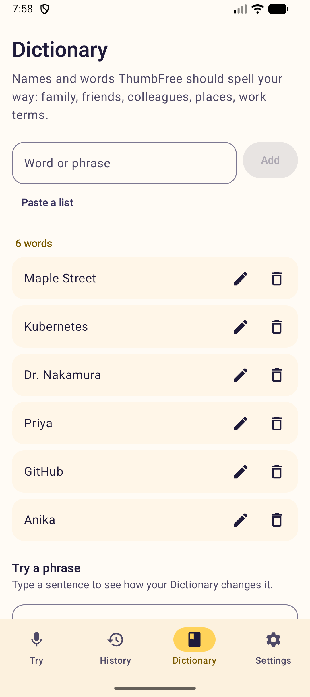
  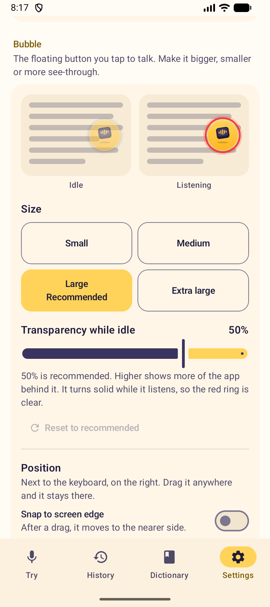
</p>
<p align="center"><b>iPhone</b></p>
<p align="center">
  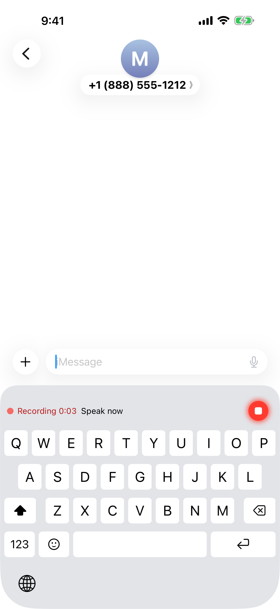
  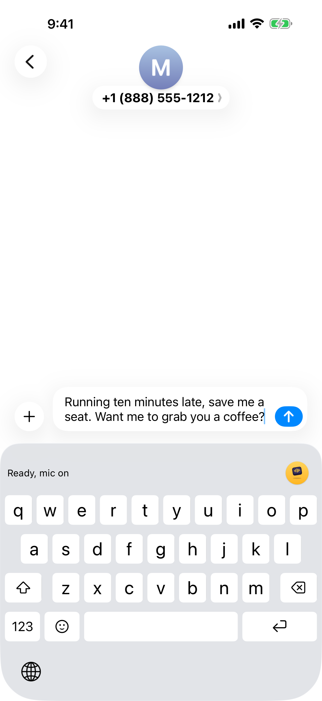
  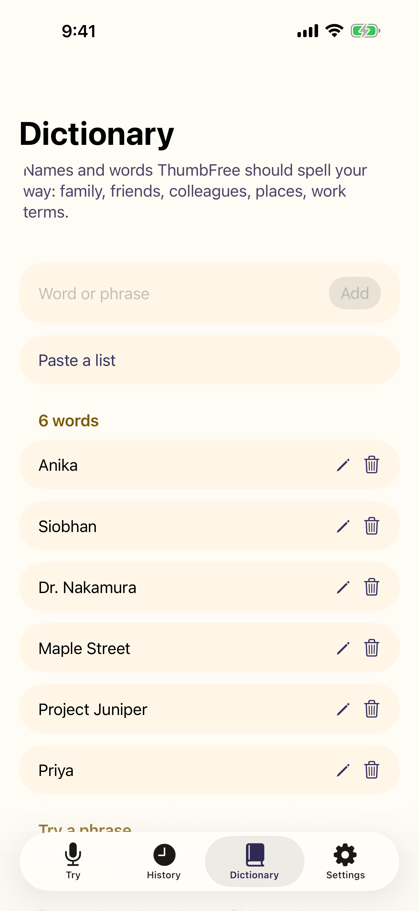
  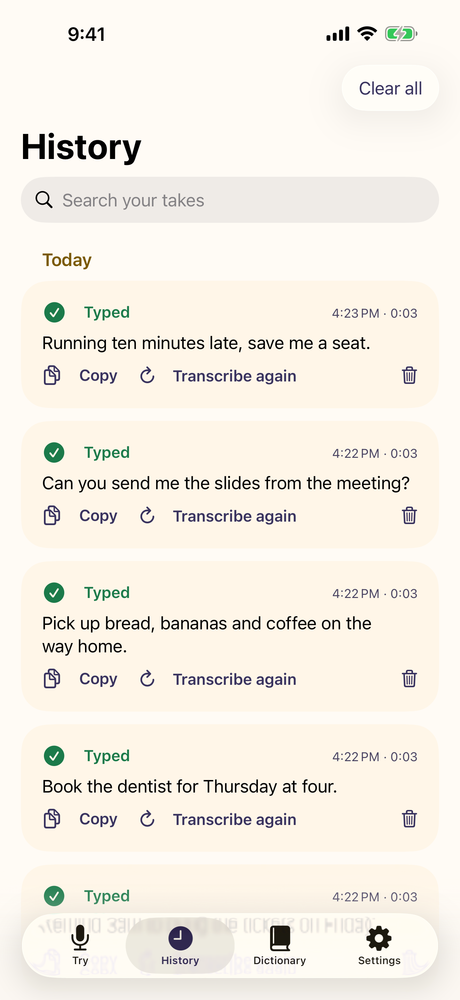
</p>

## Why ThumbFree

- **Works in every app.** Speak, and your words appear where the cursor is: messages, email, notes, search boxes. On Android you tap a yellow bubble next to the text field; on iPhone you tap the mic on the ThumbFree keyboard.
- **Private by design.** Speech is turned into text on your phone. Your audio and text never leave it. The internet is used once, to download the speech model.
- **Fast.** On a Pixel 10 the text appears 0.7 to 0.9 seconds after you stop talking, whether you spoke for 4 seconds or 30. On an iPhone 16 it is ready about 0.12 seconds after you tap stop at the end of a sentence.
- **Accurate.** Both apps run NVIDIA's Parakeet speech models. On Android the word error rate is 3.5% on our public test clips.
- **Spells your words your way.** Add names, brands and jargon to the Dictionary ("chat gpt" becomes ChatGPT).
- **Your history, your rules.** Search, copy or transcribe any take again, and choose how long takes are kept.

## Two apps, one repository

| | Android | iPhone |
|---|---|---|
| Folder | [`android/`](android/) | [`ios/`](ios/) |
| How it types into other apps | A floating bubble, run by an accessibility service | The ThumbFree keyboard |
| Speech engine | Parakeet on transcribe.cpp and ggml, in a separate process | Parakeet on Core ML, with its own runner |
| English model | Parakeet Unified EN 0.6B, 8-bit | Parakeet TDT 0.6B v2 |
| 25 European languages | Parakeet TDT 0.6B v3, 8-bit | Parakeet TDT 0.6B v3 |
| Written in | Kotlin, Jetpack Compose and C++ | Swift, SwiftUI and UIKit |

The two apps share the product rules, the brand and the docs. Each has its own code and its own engine.

## Android

### How it works

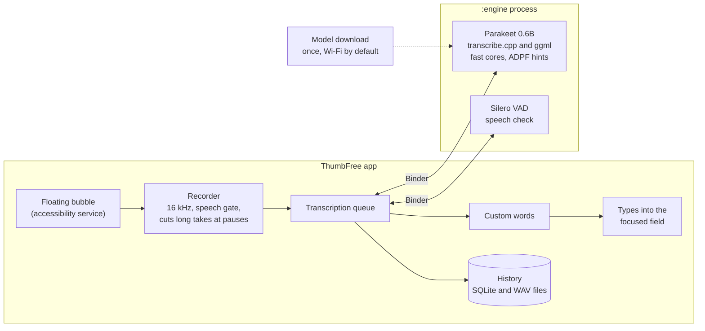

1. **Bubble.** An Android accessibility service shows the bubble when an editable field has focus and hides it otherwise. It reads only the focused field, to place text and spacing correctly. The bubble stays wherever you drop it, and you choose its size and transparency.
2. **Recorder.** Audio is captured at 16 kHz in 20 ms blocks. A speech gate and the Silero voice detector keep silence and noise from ever typing text. Long takes are cut at natural pauses and transcribed while you are still talking, which is why stop-to-text stays short at any length.
3. **Engine.** Transcription runs in a separate `:engine` process through [transcribe.cpp](https://github.com/handy-computer/transcribe.cpp) and ggml, with our own patches (`third_party/patches/`) for the audio front end, 8-bit weights, fast CPU kernels and a long-lived thread pool pinned to the fast cores. The recommended model is NVIDIA Parakeet Unified EN 0.6B (8-bit), the most accurate for English. Parakeet TDT 0.6B v3 (8-bit), a choice in Settings, speaks 25 European languages and hears which one you use.
4. **Text.** Custom words from the Dictionary fix spellings, then the text is typed into the field. Every take is saved to History until your retention setting removes it.

### Speed

| Audio length | Stop tap to text |
|---|---|
| 3.7 s | 0.69 s |
| 7.5 s | 0.77 s |
| 11 s | 0.88 s |
| 18 s | 0.88 s |
| 29 s | 0.90 s |

Time from the stop tap to the text appearing, Pixel 10, medians of 3 runs. Full results and the method are in [docs/benchmarks/2026-09-26-speed.md](docs/benchmarks/2026-09-26-speed.md).

### Build it

Requirements: Android Studio with its bundled JDK 21, Android SDK 37, NDK 30.0.16248370 and CMake 4.1.2.

```sh
git clone --recursive https://github.com/kabrapratik28/ThumbFree.git
cd ThumbFree/android
./gradlew :app:assembleDebug
adb install -r app/build/outputs/apk/debug/app-debug.apk
```

On first launch the welcome screen starts the speech model download (about 731 MB, over Wi-Fi), then the app asks for the microphone and the accessibility service while it downloads. For development, `android/tools/push-test-model.sh <serial>` copies a model from your computer instead.

Host tests, in `android/`: `./gradlew :app:testDebugUnitTest`. Device tests and the rest of the workflow are in [CONTRIBUTING.md](CONTRIBUTING.md) and [android/AGENTS.md](android/AGENTS.md).

### Experimental: live preview

The app can show your words next to the bubble while you speak. The feature is built and tested but hidden and off: it types the same text, but costs about 3 times the energy while you dictate. The measurements are in [docs/benchmarks/2026-09-26-speed.md](docs/benchmarks/2026-09-26-speed.md#live-preview).

## iPhone

- **How it types into other apps.** iOS lets no app draw over other apps or type into them, so on iPhone ThumbFree is a keyboard. Switch to the ThumbFree keyboard with the globe key, tap its mic, speak, and tap again: your words appear at the cursor. iOS gives a keyboard no microphone and too little memory for a speech model, so the keyboard asks the ThumbFree app to record, through files the two share (an App Group, which is why the keyboard asks for Full Access). The first tap of a session opens the app to turn the mic on, and it takes you back to your app (Messages, Notes and Signal so far; elsewhere you swipe back); later taps start at once. The keyboard types each take once, only into the field it belongs to.
- **Speech to text.** The app runs NVIDIA Parakeet TDT 0.6B v2 (English) or v3 (25 European languages) on Core ML with its own runner, the Encoder on the Neural Engine. On an iPhone 16 the text is ready about 0.12 seconds after you tap stop at the end of a sentence ([benchmark](ios/docs/benchmarks/2026-09-27-iphone16-device.md)).
- **A full keyboard too:** letters in Apple's layout, emoji, suggestions and autocorrect.

### Build it

You need a Mac with Apple silicon and macOS 26 or newer, Xcode 27 with the iOS 26.5 Simulator runtime, and [XcodeGen](https://github.com/yonaskolb/XcodeGen):

```sh
brew install xcodegen
git clone https://github.com/kabrapratik28/ThumbFree.git
cd ThumbFree/ios
xcodegen generate          # writes ThumbFree.xcodeproj from project.yml; git ignores it
open ThumbFree.xcodeproj   # run the ThumbFree scheme on an iPhone Simulator
```

Simulator builds need no Apple team. [ios/README.md](ios/README.md) has the features, how the app works and its speed; the tests are in [CONTRIBUTING.md](CONTRIBUTING.md) and [ios/AGENTS.md](ios/AGENTS.md).

## Project layout

| Path | What is there |
|---|---|
| `android/` | The Android app: its Gradle project, the app code (one package per area), the JNI bridge and its tools |
| `ios/` | The iOS app: the app, the keyboard, the widget, `ThumbFreeKit` (text rules and the Core ML engine), tests and tools |
| `third_party/transcribe.cpp`, `third_party/patches/` | The Android app's speech engine (a git submodule) and our patch series for it |
| `testdata/public-bench/` | Public test clips with their reference texts |
| `docs/` | Benchmarks, decisions, the brand kit and the privacy policy |
| `tools/` | Checks for the whole repository, and a Mac check of the engine patches |
| `AGENTS.md` | Instructions for contributors and AI agents, with one per folder that has its own rules |

## Privacy

- No accounts, no analytics, no ads.
- Audio and text stay on the phone. History is stored only on the phone and follows your retention setting.
- The only network use is downloading speech models from pinned Hugging Face revisions, checked with SHA-256 before use.

## Contributing

Contributions are welcome. Start with [CONTRIBUTING.md](CONTRIBUTING.md) for setup, tests and the pull request checklist; [AGENTS.md](AGENTS.md) has the full rules, for people and AI agents alike. In short: every change comes with tests, nothing leaves the phone, and no private recordings go in the repository.

## License

ThumbFree is licensed under the [Apache License 2.0](LICENSE). See [NOTICE](NOTICE). ThumbFree builds on open-source engines, NVIDIA's Parakeet models and public data, which keep their own licenses: [THIRD_PARTY_NOTICES.md](THIRD_PARTY_NOTICES.md) credits each one, with the model sources, the test audio and the dependencies.
