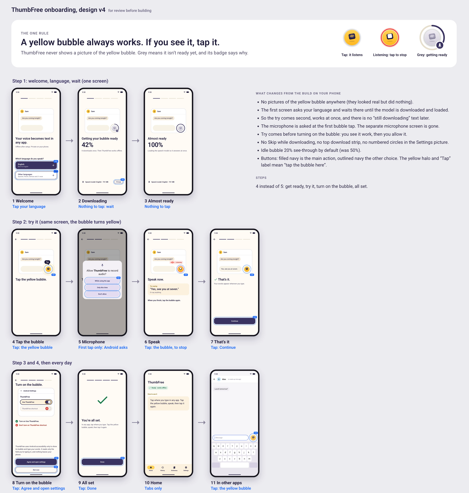
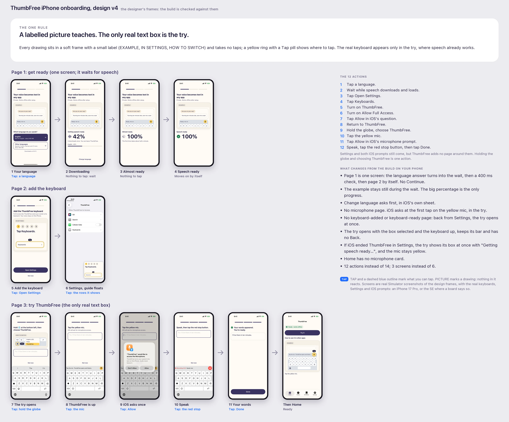

# Design boards

The boards the shipped screens were built from. Each folder starts with `00-overview`, the whole flow on one page; the
other boards show one screen each, with what can be tapped (a dashed blue outline marked TAP) and what comes next. All
content on them is made up.

| Folder | What it shows | Shipped in |
|---|---|---|
| [`android-onboarding-v4/`](android-onboarding-v4/) | The Android welcome: language and wait, the try, turning on the bubble, all set; then Home, the bubble in other apps, what happens when something stops, and what to say on the try | Android 1.0 (2) and later |
| [`ios-onboarding-v4/`](ios-onboarding-v4/) | The iPhone welcome: language and wait, adding the keyboard with the floating guide, the try; then Home, Not now, and the accessibility details | iPhone 1.0.1 |

The rule behind each design:

- **Android:** a yellow bubble always works. If you see it, tap it. When it can't work yet it is grey, and its badge
  says why (download, Wi-Fi or microphone). The app never shows a picture of the yellow bubble.
- **iPhone:** a labelled picture teaches; the only real text box is the try. Drawings sit in a soft frame with a small
  label (EXAMPLE, IN SETTINGS, HOW TO SWITCH) and take no taps; a yellow ring with a Tap pill shows where to tap.

When a screen changes, replace its boards in the same change, or delete them, so the boards always match the app.

