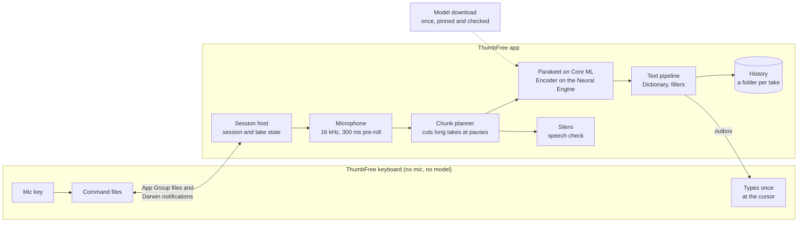

<p align="center">
  
</p>

<h1 align="center">ThumbFree for iPhone</h1>

<p align="center"><b>Talk instead of typing, in any app. Offline, private and fast.</b></p>

ThumbFree is a keyboard with a mic. Switch to it in any app, tap the mic, say what you want to write, and tap again:
your words appear at the cursor. Speech becomes text on your iPhone, with NVIDIA's Parakeet speech model on the Neural
Engine. ThumbFree for iPhone is the sibling of ThumbFree for Android, the same app for Android phones, which sits beside
it in this repository ([README](../README.md)).

## Why ThumbFree

- **Works in every app.** Switch to the ThumbFree keyboard with the globe key, tap the mic at the top right, speak, and tap again. Or hold the mic while you talk and let go. Your words appear where the cursor is: messages, email, notes, search boxes.
- **Private by design.** Speech is turned into text on your iPhone. Your audio and your text never leave it. The internet is used only to download the speech model.
- **Fast.** Long takes are transcribed in pieces while you are still talking, so there is little left to do when you stop. On an iPhone 16 the text is ready about 0.12 seconds after you tap stop at the end of a sentence, and at once if you pause for a second first.
- **Accurate.** It runs NVIDIA's Parakeet TDT 0.6B, with about a 3% word error rate on our public test clips.
- **A full keyboard.** Letters, numbers and symbols in Apple's layout, which changes with the field (an email address, a web address, a number pad). Shift and caps lock, automatic capitals, a double space for a full stop, accents on a long press, the space bar as a trackpad, delete by whole words when you hold it, a return key labelled for the field, light and dark mode, landscape and VoiceOver.
- **Emoji.** The emoji key opens every emoji in Apple's order, with search, skin tones and the ones you use most.
- **Suggestions and autocorrect.** Three suggestions above the keys as you type, autocorrect you can undo (press delete, then tap the word you typed), smart quotes, and your own text replacements. Names from your contacts and your Dictionary are never corrected.
- **Spells your words your way.** Add names, brands and jargon in the Dictionary tab ("chat gpt" becomes ChatGPT).
- **A mic you control.** While you talk, the mic turns into a red stop key and the keyboard shows Recording and the time. iOS shows its orange dot while the mic is on. After your last take the mic stays on for the time you choose (2, 5, 15 or 60 minutes), so your next tap starts at once; then it turns off by itself, or tap End session.
- **Your history, your rules.** Search, copy or transcribe any take again, and keep takes for as many days or as many takes as you like.
- **More languages.** The Multilingual model understands 25 European languages.

## How it works



1. **Keyboard.** iOS lets no keyboard use the microphone, and a keyboard's memory is too small for a speech model. So the keyboard asks the ThumbFree app to record, through files in a folder the two share (the App Group), which is why the keyboard needs Full Access. The first tap of a session opens ThumbFree to turn the mic on, and you swipe back to your app. Every tap for the next few minutes starts at once, right where you are.
2. **Session.** The app keeps the mic open for the session with the last 300 ms of audio in hand, so a take starts with the words just before your tap. The model loads when the session starts and stays warm for it.
3. **Engine.** Transcription runs in the app with ThumbFree's own Core ML runner for Parakeet TDT: the Encoder on the Neural Engine, the rest on the CPU, never the GPU. Long takes are cut at natural pauses and transcribed while you talk; a pause starts the final pass early, and the stop runs it at once. A speech gate and the Silero voice detector keep silence and noise from typing text.
4. **Text.** Dictionary words fix spellings, fillers go, and the text is fitted to the cursor's spacing and capitals. It is saved to History before the keyboard types it, once, and only into the field it belongs to. Anything else waits behind Insert here and Copy.

Going back by itself needs a private iOS interface to learn which app you were typing in, so only Debug builds have it
(for apps checked on an iPhone, with Settings > Go back to the app automatically to turn it off); store builds do not.

### Project layout

| Path | What is there |
|---|---|
| `App/` | The app: session, audio capture, model downloads, the Home, History, Dictionary and Settings tabs (SwiftUI) |
| `Keyboard/` | The keyboard extension (UIKit keys with a SwiftUI bar, the emoji picker) |
| `Shared/` | Code the app and the keyboard share: the key model, suggestions, emoji, commands and delivery |
| `Intents/`, `Widgets/` | Start ThumbFree, a Control Center control and Shortcut that turn the mic on ahead of your next tap |
| `ThumbFreeKit/` | A Swift package: `TFCore` (text rules, take state machine, audio rules, History) and `TFEngine` (the Parakeet runner and the speech check) |
| `tools/` | Test, Simulator, App Store and model scripts |
| `docs/` | The contract between the parts, benchmarks, the privacy and support pages. The App Store listing and images are in [docs/brand/ios](../docs/brand/ios/) |
| `Config/` | Signing: `Signing.xcconfig`, and your own team in the git-ignored `Signing.local.xcconfig` |
| `AGENTS.md` | Instructions for contributors and AI agents; `App/`, `Keyboard/`, `ThumbFreeKit/`, `UITests/` and `tools/` have their own |

## Speech models

On first launch, Get started downloads the English model: NVIDIA Parakeet TDT 0.6B v2 in FluidInference's Core ML
conversion, about 465 MB with the speech check. If one of your iPhone's languages is among the Multilingual model's 24
languages besides English, it downloads that model instead: Parakeet TDT 0.6B v3, about 484 MB. The first screen offers
the other model, and Settings has both. Both are NVIDIA's, under CC BY 4.0. Downloads come from Hugging Face at pinned
revisions, keep going in the background, use Wi-Fi unless you allow mobile data, and need about 1.5 GB of free space.
Every file is checked by size and SHA-256 before it is used. The first start after a download takes about half a minute
while iOS prepares the model for your iPhone, and again after an update of ThumbFree or iOS.

## Speed and accuracy

| When you tap stop | Stop tap to text |
|---|---|
| Mid-word | 0.40 s |
| Right at the end of speech | 0.12 s |
| 300 ms after you stop talking | 0.12 s |
| 1 s after you stop talking | at once |

iPhone 16 with iOS 26.5, through the app's live transcriber, medians of 3 runs; the keyboard's typing is not included.
The engine turns 11 s of speech into text in 55 ms on the Neural Engine, 140 ms on the CPU. Details and the method:
[docs/benchmarks/2026-09-27-iphone16-device.md](docs/benchmarks/2026-09-27-iphone16-device.md). On iOS 27, keyboard
takes run on the CPU until Apple grants the app its Background Inference entitlement.

Word error rate on 12 public English clips (LibriSpeech and JFK): 3.33% in one pass, 3.03% as the app transcribes while
you talk, with the same model files on a Mac's Neural Engine
([docs/benchmarks/2026-09-27-stop-to-text.md](docs/benchmarks/2026-09-27-stop-to-text.md)).

## Privacy

- No accounts, no analytics, no ads, no tracking.
- Audio and text stay on your iPhone. History follows your retention setting and is left out of backups.
- The only network use is the model download, from pinned Hugging Face revisions checked with SHA-256.
- The keyboard reads the text around the cursor to place your words. It never goes online, and nothing it reads leaves your iPhone.

The full policy: [docs/privacy.md](docs/privacy.md).

## Requirements

- To use ThumbFree: an iPhone with iOS 26 or newer, and about 1.5 GB of free space for the download. It is tested on an
  iPhone 16; iPhones with 3 to 4 GB of memory have not been tried.
- To build it: a Mac with Apple silicon and macOS 26 or newer, Xcode 27 with the iOS 26.5 Simulator runtime, and
  [XcodeGen](https://github.com/yonaskolb/XcodeGen).

## Build and run

```sh
brew install xcodegen
git clone <repository-url>
cd ThumbFree/ios
xcodegen generate                   # writes ThumbFree.xcodeproj, which git ignores
open ThumbFree.xcodeproj            # run the ThumbFree scheme on an iPhone Simulator
tools/test-kit.sh                   # package tests on the Mac
TF_SIM="iPhone 17 Pro" tools/test-app.sh   # app unit and UI tests on a Simulator
```

Simulator builds need no Apple team. Once the app is on a Simulator, `tools/sim-enable-keyboard.sh "iPhone 17 Pro"`
adds the keyboard; then turn on Allow Full Access in the Simulator's Settings > General > Keyboard > Keyboards >
ThumbFree. The tests that run the real speech model need the pinned models on your Mac: `python3 tools/fetch-models.py`
(about 950 MB). Without them those tests skip.

To build for your iPhone, put your Apple team in `Config/Signing.local.xcconfig`, which git ignores:

```sh
echo 'DEVELOPMENT_TEAM = <your team id>' > Config/Signing.local.xcconfig
```

A team other than the maintainer's also needs its own bundle ids and App Group, since Apple registers each to one team:
see "On a phone" in [AGENTS.md](AGENTS.md).

## Contributing

Contributions are welcome. Start with [CONTRIBUTING.md](../CONTRIBUTING.md) for setup, tests and the pull request
checklist. [AGENTS.md](AGENTS.md) has this app's rules, the repository's [AGENTS.md](../AGENTS.md) those of both apps,
and [tools/AGENTS.md](tools/AGENTS.md) those of the scripts, for people and AI agents alike. In
short: every change comes with tests, nothing leaves the phone, and no private recordings go in the repository.

## License

ThumbFree is licensed under the [Apache License 2.0](../LICENSE). See [NOTICE](../NOTICE). The speech models and the
data it builds on keep their own licenses: see [THIRD_PARTY_NOTICES.md](../THIRD_PARTY_NOTICES.md).

## Credits

The speech models, the word list, the emoji data and the adapted text rules are credited, with their licenses, in
[THIRD_PARTY_NOTICES.md](../THIRD_PARTY_NOTICES.md) and in the app under Settings > About.

## Status

ThumbFree for iPhone works end to end on an iPhone 16 and on the Simulator.
